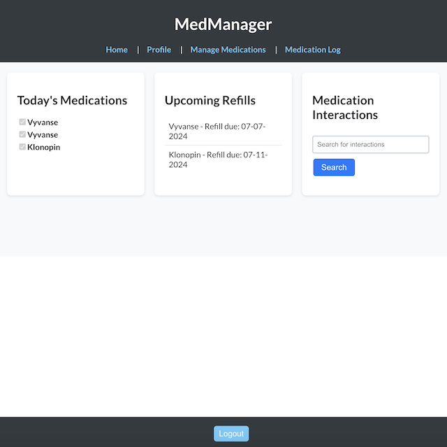
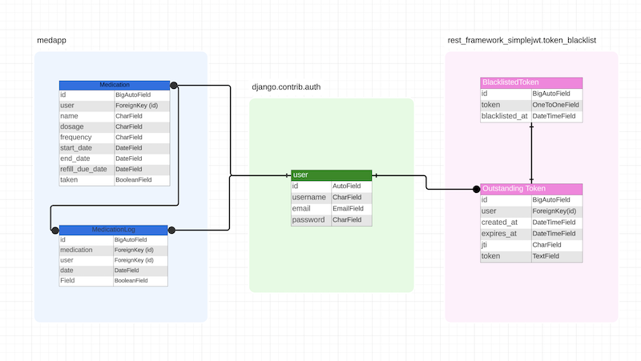

<!-- markdownlint-disable -->
# MedManager

#

# Deployment Link
<a href="https://medmanager.netlify.app/login"> MedMangager</a>

Heroku URl:
<a href="https://medmanager-b797ac84ca9c.herokuapp.com">Backend URL</a>

Backend Repository:
<a href="https://github.com/jpantano30/MedManager-Backend">Backend Repository</a>

#

## Description:

**MedManager** is an application designed to help users effectively manage their medication schedules. It provides functionalities such as tracking daily medication intake, setting reminders for medication refills, and accessing information on medication interactions via the FDA API. The main goal of MedManager is to improve adherence to medication regimens, enhance patient safety, and reduce missed doses.

#

#### Technologies used:

<!--  -->
<!--  -->

#

#### Installation Steps:

1. **Fork & Clone the repository:**
  - In GitHub, navigate to the main page of the repository.
  - In the top-right corner of the page, click Fork.
  - Click the green "Code" button and copy the link.
  - Open the terminal on your computer and navigate to the directory where you would like to clone the repository. 
  - Use the following command in your termial to clone the repository from Github.
  - git clone [YOUR_REPOSITORY_URL_HERE]
    - This must be done for both the front and back end repositories.
2. **Install Dependencies:**
  - Navigate to the front end repository and run the following command in your terminal:
    - npm i
  - Navigate to the back end repository and run the following command in your terminal:
    - pip install -r requirements.txt
3. **Run the application:**
  - Navigate to the front end repository and run the following command in your terminal:
    - npm start
    - The application will run on port 3000 unless otherwise specified.
  - Navigate to the back end repository and run the following command in your terminal:
    - python manage.py runserver
    - The server will run on port 8000 unless otherwise specified.

#

 User Stories:

 <ul>
  <li> As a user, I want to register an account, so that I can log in and manage my medications.</li>
  <li> As a user, I want to add my medications with dosage and schedule details, so that I can keep track of my medication regimen.</li>
  <li> As a user, I want to search for my medications, so that I can see what it interacts with.</li>
 </ul>

#

 
 🎨 Wireframes 

   
 
    
 ✏️ Rough Sketch 

      
      
   

#

#### Entity Relationship Diagrams

#

#### Unsolved Problems & Challenges

- **Authentication Issues:** Although users can successfully register and sign in, the app allows unauthenticated access, resulting in error displays when accessed without logging in.
- **Date Formatting:** Challenges encountered in formatting date information when communicating between the frontend and the backend.
- **API Result Formatting:** Difficulties in formatting the results retrieved from the interaction checker to make them more user-friendly.
- **CRUD Operations:** Challenges with fetch requests while managing CRUD operations for medications using the Django backend. Specifically, DELETE requests were not completing successfully, even though a 204 No Content response was received. This issue was resolved by using `response.text()` in the return statement instead of returning an empty object.
- **Deployment Issues:** Issues with deployment of the app to Heroku and Netlify. Prior to deployment the app worked but after I ran into many errors. The app currently works but if you try to open the Heroku deployed app, it will not load and responds with a 404 (Not Found).

#

 
 
 ❓ Future Features 

 <ul>
  <li> Address the aforementioned unsolved problems. </li>
  <li> Enable guest access to the app without errors. </li>
  <li> Improve the readability of the interaction search results. </li>
  <li> Introduce the ability to edit logged medications. </li>
  <li> Enhance the overall styling of the app. </li>
  <li> Enable notifications for scheduled medication intake and refill reminders. </li>
 </ul>

#